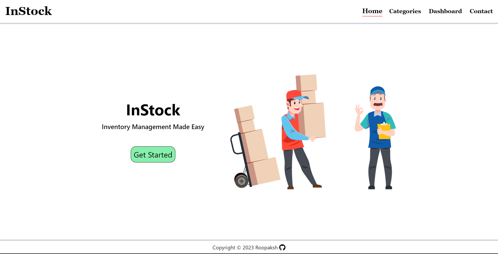
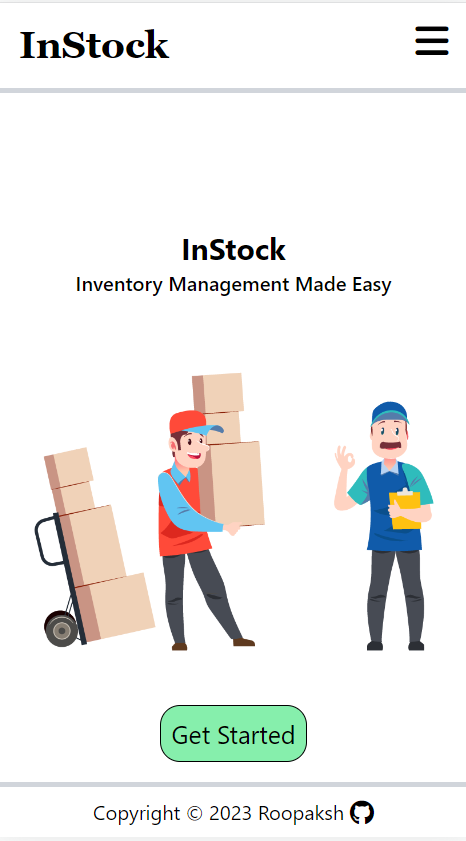
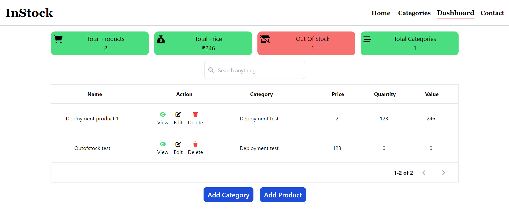

<div align=center>
<h1 align=center>InStock</h1>
<p>An inventory management app. It has product and category management with CRUD Operation.<br> <b>Live 👇</b><p>
<a href=https://instockapp.netlify.app/>
</div></a>

<div align=center>
  
</div>

## Built With


## Features

### Product And Category Management

Perform actions like add, edit and delete the product from the dashboard. If there is no product inside the category then the category will be removed. All form data gets validated with the express-validator library. Images are handled with cloudinary.

### User Authentication

Authentication is done using jsonWebToken, passportjs and bcryptjs packages. Password is hashed using bcryptjs before saving in database. All products are linked with the user so that each user only has access to their products. 

## Installation

To get a local copy up and running follow these simple example steps.

1. Clone the Repo

```
git clone git@github.com:Roopaksh1/online-tic-tac-toe.git
```

2. Install the dependencies

```
cd frontend
npm install

cd backend
npm install
```

3. To run this project, you will need to add the following environment variables to your .env file

```
Inside backend
PORT
MONGODB_URI
CLOUD_NAME
CLOUDINARY_API_KEY
CLOUDINARY_API_SECRET

Inside frontend
VITE_API_URL
```

4. Run the server

```
cd backend
node index.js
```

5. Run the client

```
cd frontend
npm run dev
```

Open your browser and navigate to [http://localhost:5173/](http://localhost:5173/)

## Screenshots

<div align=center>
  
  <br/>
  
</div>
